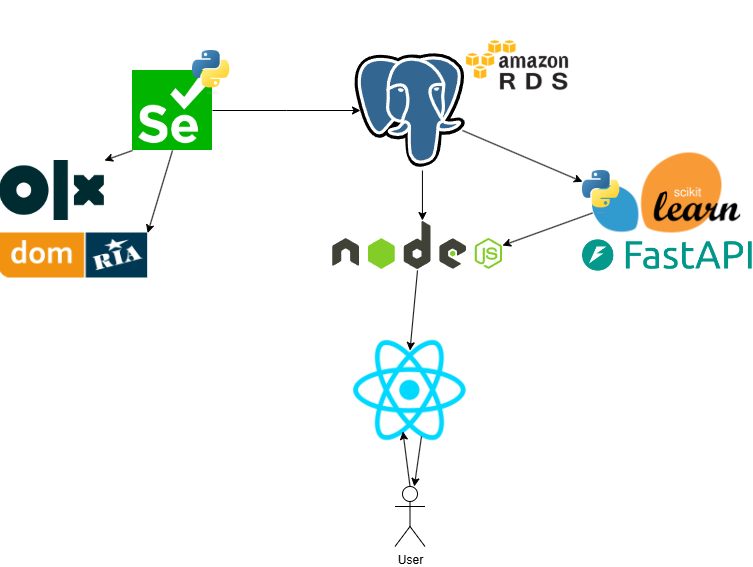

# Real Estate Price Estimation Platform

## **Project Overview**
This platform estimates the approximate price of real estate based on user-provided data. It utilizes data scraped from popular property listing websites and applies machine learning models to deliver accurate price predictions.

The platform is modular and consists of multiple microservices, each focused on a specific task, ensuring scalability and maintainability.

---

## **Project Architecture**

### The project is divided into the following parts:

#### 1. **Backend (Node.js)**
- **Description:**  
  The backend serves as the main API for the platform, handling user authentication, data processing, and communication with the ML service.
- **Tech Stack:**
    - **Node.js** (Express.js)
    - RESTful APIs
    - Docker
    - AWS RDS (PostgreSQL) for database storage.
- **Repository:**  
  [Link to Backend Repository](https://github.com/io-23SklyarAnton/priceroom-backend.git)

---

#### 2. **Frontend (React)**
- **Description:**  
  The user-facing interface allows users to input property details and view estimated prices.
- **Tech Stack:**
    - **React.js**
    - **Axios** for API requests
    - Docker for containerization
- **Repository:**  
  [Link to Frontend Repository](https://github.com/io-23SklyarAnton/priceroom-front.git)

---

#### 3. **Machine Learning Service (Python + FastAPI)**
- **Description:**  
  This microservice is responsible for training and serving a machine learning model that predicts real estate prices based on historical data.
- **Tech Stack:**
    - **Python**
    - **FastAPI** for creating RESTful APIs
    - **scikit-learn** for model training
    - Docker for deployment
- **Repository:**  
  [Link to ML Service Repository](https://github.com/io-23SklyarAnton/priceroom-ml.git)

---

#### 4. **Scraper (Python)**
- **Description:**  
  Collects data on real estate listings from websites like OLX and DOMRIA. The data is stored in the shared PostgreSQL database.
- **Tech Stack:**
    - **Python**
    - **Requests** and/or **Selenium** for web scraping
- **Repository:**  
  [Link to Scraper Repository](https://github.com/io-23SklyarAnton/priceroom-scraper)

---

## **Infrastructure**

### 1. **Database (AWS RDS)**
- PostgreSQL is used to store the collected real estate data and user inputs.
- Hosted on **AWS RDS**, ensuring reliability and scalability.

### 2. **Containerization with Docker**
- Each microservice is containerized for easy deployment.
- Docker Compose is used to manage the services in local development environments.

### 3. **CI/CD with GitHub Actions**
- **Automatic Testing and Deployment:**
    - Each repository uses GitHub Actions for linting, testing, and building images.
    - Pushes to the `main` branch trigger Docker image builds and deployments.

---

## **How the Platform Works**

1. **Data Collection:**  
   The scraper collects real estate listings from external websites and stores the data in the PostgreSQL database.

2. **Price Prediction:**
    - The machine learning service processes user inputs and predicts the price of the property using trained models.
    - The ML model is periodically retrained using the collected data.

3. **User Interaction:**
    - Users interact with the platform via a React-based frontend.
    - The frontend communicates with the backend (Node.js), which coordinates requests to the ML service.

---

## **Getting Started**

### Prerequisites
- Docker
- Node.js (v18 or higher)
- Python (3.10 or higher)
